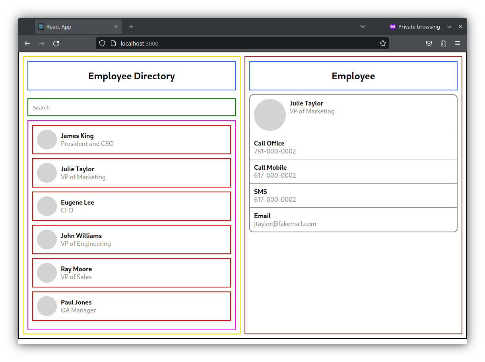

# ALAB 320H.1.1 - React Page Layout

This project utilizes a JSON file for the employee data. The JSON is parsed to populate the "employeeList". For purposes of this demo, the right pane is currently showing "employeePage" for employeeId 10001. That particular employeeId includes some additional fields "Call Office", "Call Mobile" etc. If those fields are not present, the app will just display name and title (required).

## Available Scripts

In the project directory, you can run:

### `npm start`
